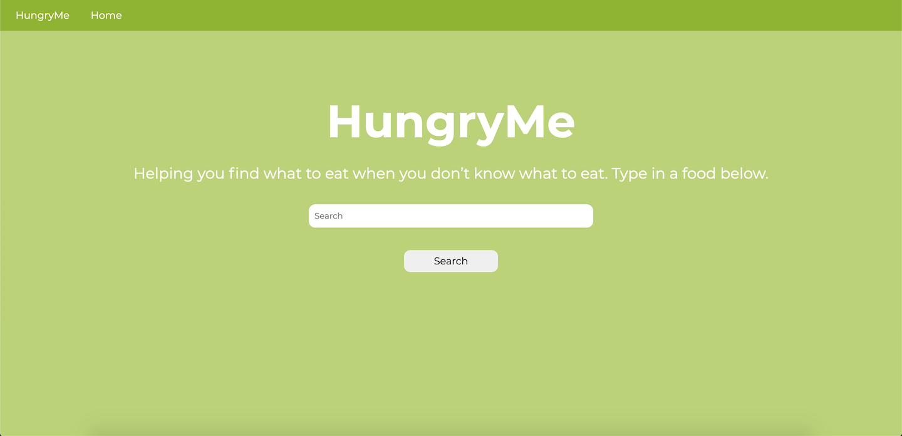
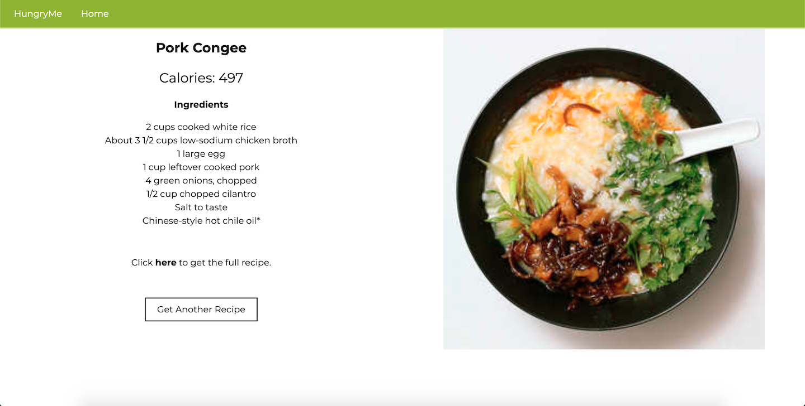

# HungryMe

HungryMe is a web app where users can generate a recipe to use if they don't know what to eat. It gets a random recipe based off the user's search result.

HungryMe utilizes the Edamam API, which is a database for recipes, food, and ingredients.


## Screenshots

 
Home Page


Random pork recipe search


## Installation
Note: HungryMe is not yet connected via a web service, and can only run on localhost as of right now.

1. Clone the GitHub repository or download a zip file.

2. Download Flask in the command line.
    ```
    $ pip3 install flask
    ```

3. Run the main.py file. The app will be served at http://127.0.0.1:5000/.

For more help with installing Flask, consult the [Flask docs](https://flask.palletsprojects.com/en/1.1.x/installation/).


### Technologies
- Python 3.8
- Flask
- HTML
- CSS


## Future Features
- Send the recipe link to your phone via another API
- Help page


## License
[MIT](https://choosealicense.com/licenses/mit/)